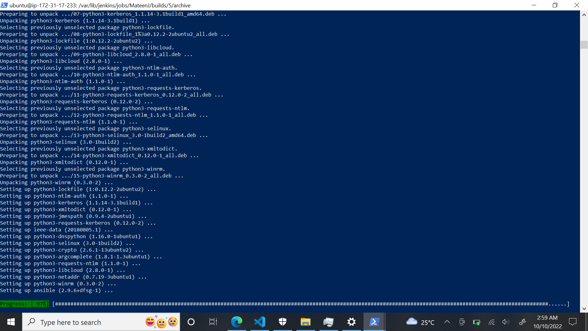
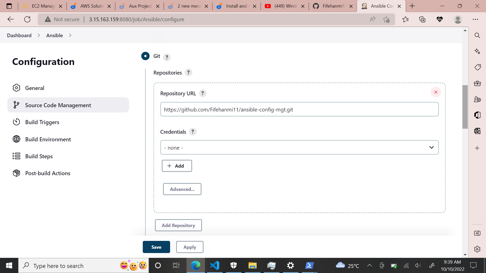
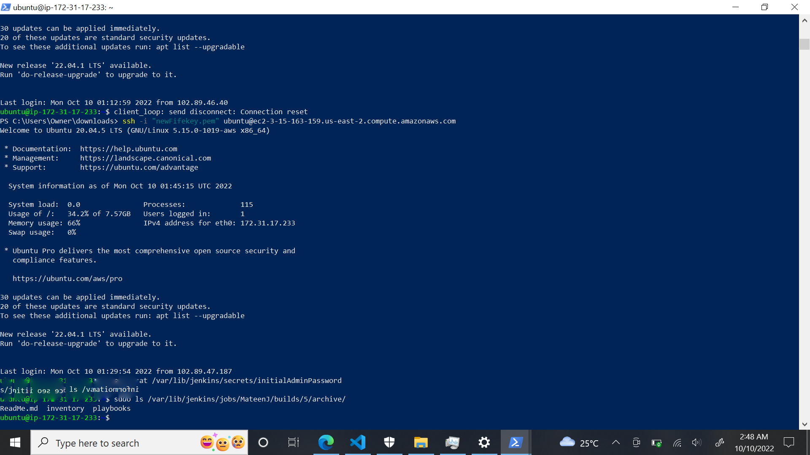
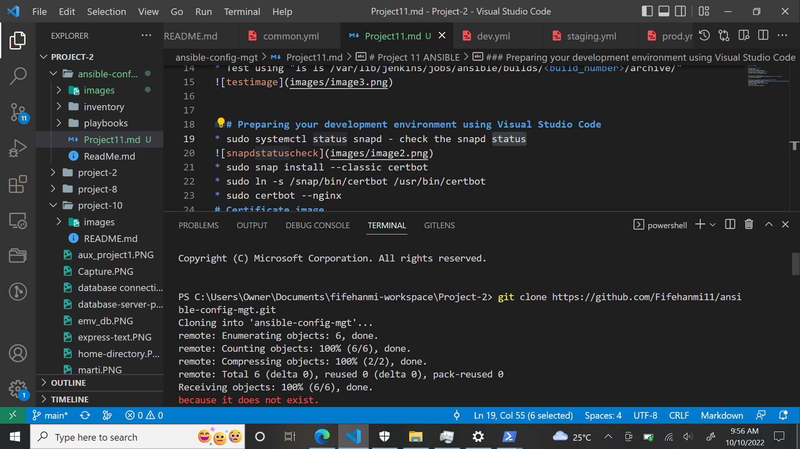
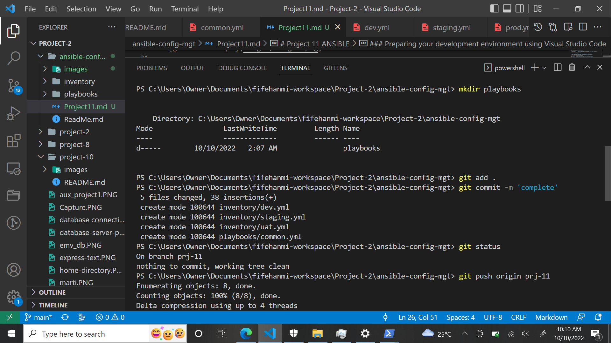
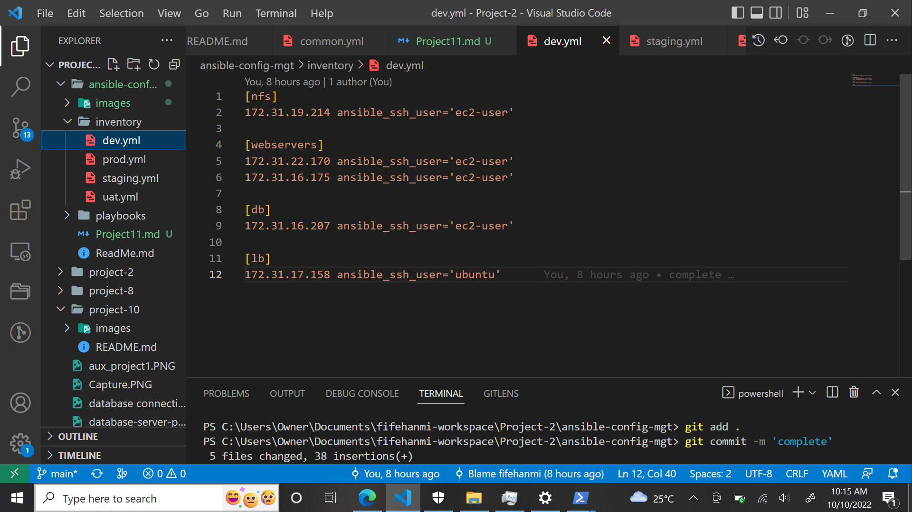
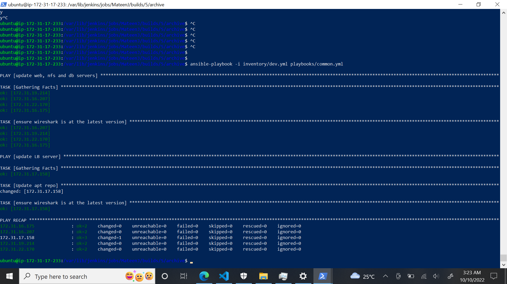

# Project 11 ANSIBLE

### Update and Install ansible
* sudo apt update
* sudo apt install ansible

### Configuration for Ansible on Jenkins Server
* Configure Ansible on Jenkins Server

### Testing the Ansible Configuration
* Test using "ls ls /var/lib/jenkins/jobs/ansible/builds/<build_number>/archive/"

### Preparing your development environment using Visual Studio Code
* Clone git to local development area "git clone < repository link >"

### Preparing your development environment using Visual Studio Code
* Clone git to local development area "git clone < repository link >"

* Branch created "prj-11" - git checkout -b prj-11
* create new directories "Playbooks & Inventory" -

### Preparing your development environment using Visual Studio Code
* Clone git to local development area "git clone < repository link >"

* Branch created "prj-11" - git checkout -b prj-11
* create new directories "Playbooks & Inventory" -

* Dev.yml - "Setup for Dev"

## Ansible Test
* Ansible Complete - "ansible-playbook -i inventory/dev.yml playbooks/common.yml"

